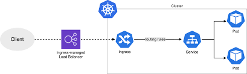

The Deployment and Services YAML Definitions, ArgoCD App could watch these .yaml files for changes.

The deployment uses a hello world flask api via a docker image, /hello endpoint will result in "Hello, World!"

